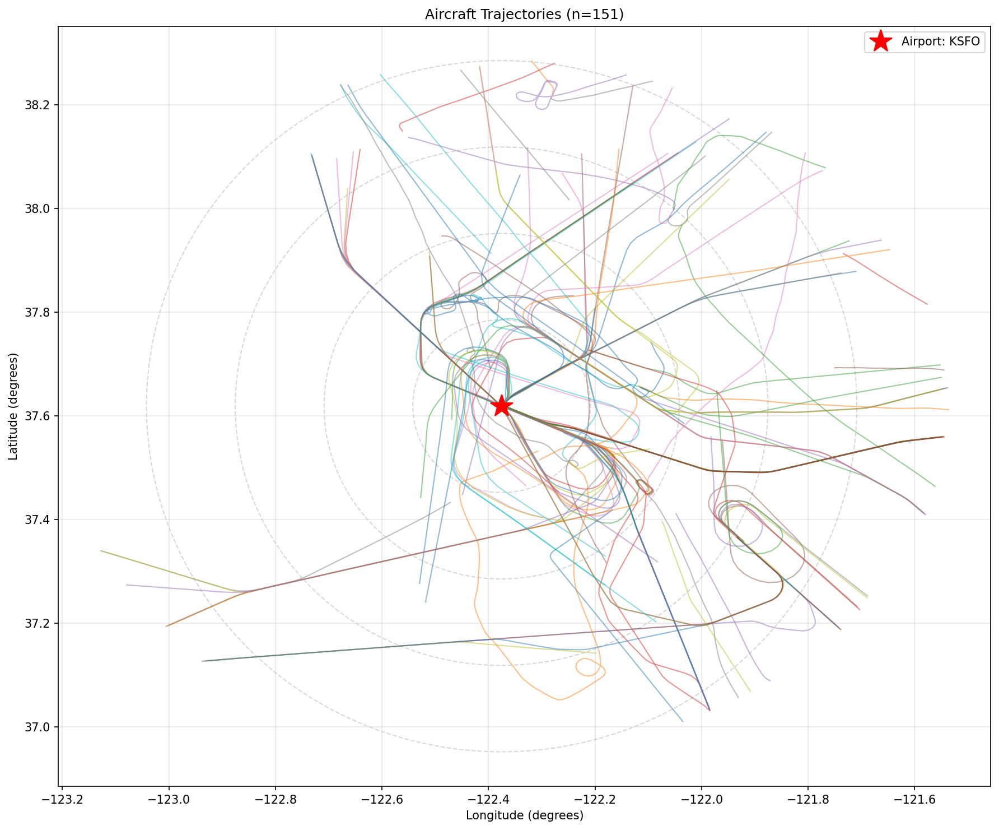
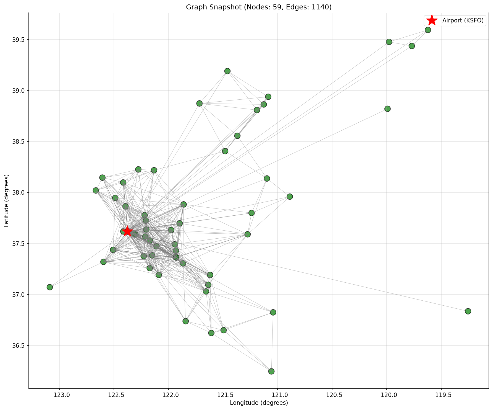
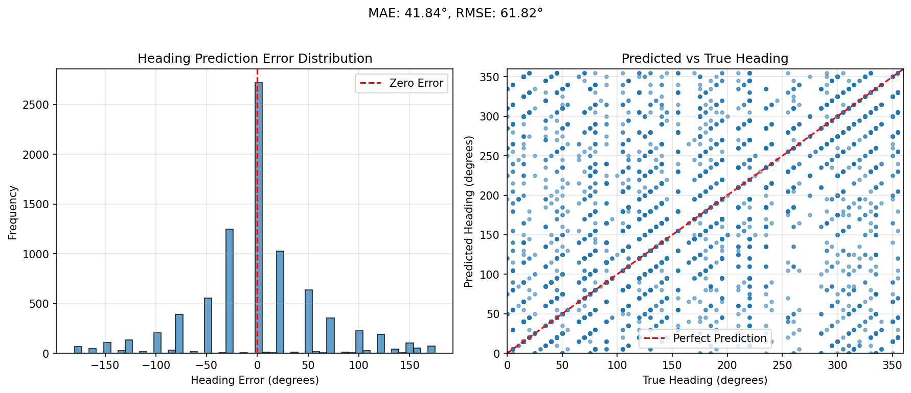

# Aircraft Heading Prediction with Graph Neural Networks

Next heading prediction for aircraft in terminal area operations using GNN's.

## Overview

This project uses Graph Neural Networks (GNNs) to predict future aircraft headings based on ADS-B surveillance data. The model captures spatial relationships between aircraft and temporal patterns in trajectories to forecast heading changes 15 seconds ahead.

### Sample Visualizations


*Aircraft trajectories in terminal area with predicted vs actual headings*



*Graph of 1 snapshot of aircraft interactions in the terminal area*



*Model prediction error analysis and distribution*

## Features

- **Data Pipeline**: Load and preprocess OpenSky ADS-B data
- **Graph Construction**: Build spatial-temporal graphs from aircraft states
- **Multiple Models**:
  - `BaseGNN`: Graph Convolutional Network (GCN) baseline
  - `GATHeadingPredictor`: Graph Attention Network with multi-head attention
- **Custom Loss**: Circular heading loss that respects angular geometry
- **Comprehensive Evaluation**: MAE, RMSE, accuracy at multiple tolerances
- **Visualization**: Trajectory plots, attention weights, error analysis

## Installation

```bash
# Clone repository
git clone https://github.com/Josem419/aircraft_heading_gnn.git
cd aircraft_heading_gnn

# Create virtual environment (optional but recommended)
python3.11 -m venv gnn_env
source gnn_env/bin/activate

# source the local environment setup script
source setup_env.sh

# Install dependencies
pip install -r requirements.txt
```

## Data

Download ADS-B data from [OpenSky Network](https://opensky-network.org/datasets/#states/).

Dataset format: CSV with columns `time,icao24,lat,lon,velocity,heading,vertrate,callsign,onground,alert,spi,squawk,baroaltitude,geoaltitude,lastposupdate,lastcontact`

This folder should contain raw and processed data. That said, ADS-B csv's are quite large.

So instead of including them in the repo, you can download a sample file from here:

https://opensky-network.org/datasets/#states/
Dataset description found here: https://s3.opensky-network.org/data-samples/states/README.txt
After downloading, place the CSV files in the `data/raw/` directory.

## Quick Start

  ```bash
  # Train a GAT model on KSEA terminal area
  python train.py \
      --data_path data/states_2024_01_01.csv \
      --airport_icao KSEA \
      --model_type gat \
      --num_epochs 50 
  ```

## Project Structure

- **src/aircraft_heading_gnn/** - Main package directory
  - **data/** - Data processing and loading
    - `preprocessing.py` - Data loading and cleaning utilities
    - `dataset.py` - PyTorch Geometric dataset implementation
    - `labeling.py` - Future heading computation
    - **test/** - Data module tests
      - `test_parquet.py` - Parquet dataset loading tests
  - **models/** - Neural network architectures and training
    - `base_gnn.py` - GCN and GAT model implementations
    - `training.py` - Training pipeline and loss functions
    - `evaluation.py` - Metrics computation and analysis
    - `__init__.py` - Model registry and imports
  - **utils/** - Utility functions
    - `angles.py` - Circular angle mathematics
    - `adsb_features.py` - Geographic distance and bearing calculations
    - `visualization.py` - Plotting and visualization utilities
    - `plot_training.py` - Training curve visualization
    - `__init__.py` - Utils package initialization
  - `__init__.py` - Main package initialization
- **scripts/** - Analysis and training tools (see Scripts section above)
- **data/** - Data storage directory
  - `airports.json` - Airport reference coordinates  
  - `processed/` - Cached processed datasets
  - `raw/` - Downloaded OpenSky data files
- **checkpoints*/** - Model training outputs
- **analysis/**, **plots/**, **prediction_analysis/** - Generated visualizations
- **setup_env.sh** - Environment setup script
- **requirements.txt** - Python dependencies
- **README.md** - Project documentation

## Model Architecture

### Node Features (10D)
- Position: lat/lon (normalized)
- Heading: sin/cos encoding
- Velocity, altitude, vertical rate
- Distance/bearing to airport

### Edge Features (5D)
- Distance between aircraft
- Bearing (sin/cos)
- Relative heading (sin/cos)

### Prediction
- 72 heading classes (5° bins)
- 15-second prediction horizon

## Performance Expectations

Typical performance on terminal area data:
- **Exact accuracy**: ~35-45% (vs 1.4% random)
- **MAE**: ~15-25 degrees
- **±10° accuracy**: ~60-70%
- **Turn direction**: ~75-85%

## Quick Start

### Basic Training
To run the training script with default parameters, use the following command:

```bash
# Train a GAT model on KSEA terminal area with parquet data
cd scripts
python train.py \
    --parquet_path ../data/processed/out.parquet \
    --airport_icao KSEA \
    --model_type gat \
    --num_epochs 50 
```

### Quick Visualization
Generate all basic visualizations with one command:

```bash
./scripts/quick_viz.sh KSEA
```

## Scripts and Tools

The `scripts/` directory contains a comprehensive suite of tools for data processing, training, analysis, and visualization.

### Training Scripts

#### `train.py` - Main Training Pipeline
The primary training script for aircraft heading prediction models.

**Key Features:**
- Supports GAT (Graph Attention Network) and GCN (Graph Convolutional Network) models
- Built-in train/validation/test splitting with temporal awareness
- Comprehensive evaluation with multiple metrics
- Model checkpointing and early stopping
- Optional visualization generation
- GPU/CPU automatic detection

**Usage:**
```bash
python scripts/train.py \
    --parquet_path data/processed/out.parquet \
    --airport_icao KSEA \
    --model_type gat \
    --num_epochs 100 \
    --learning_rate 0.001 \
    --hidden_dim 128 \
    --batch_size 32 \
    --save_dir checkpoints/
```

**Key Arguments:**
Check the usage instructions with `--help` for a full list of options.

#### `simple_train.py` - Streamlined Training
A simplified training script focused on architecture validation and quick experiments.

**Features:**
- Lightweight training loop
- Basic accuracy reporting
- Minimal dependencies
- Good for testing model architectures

**Usage:**
```bash
python scripts/simple_train.py \
    --parquet_path data/processed/out.parquet \
    --airport_icao KSEA \
    --model_type gat \
    --num_epochs 20
```

### Data Processing Scripts

#### `download_opensky_data.py` - Data Acquisition
Downloads OpenSky ADS-B data files for training.

**Features:**
- Multi-day data collection
- Automatic URL generation
- Peak hour sampling
- Progress tracking with resumption support

**Usage:**
```bash
python scripts/download_opensky_data.py \
    --start_date 2024-01-01 \
    --num_days 3 \
    --hours_per_day 4 \
    --output_dir data/raw/ \
    --resume
```

#### `process_opensky_to_parquet.py` - Data Conversion
Converts raw OpenSky tar/CSV files to optimized parquet format.

**Features:**
- Batch processing of tar files
- Automatic CSV extraction
- Memory-efficient streaming
- Data validation and cleaning

**Usage:**
```bash
python scripts/process_opensky_to_parquet.py \
    --input_dir data/raw/ \
    --output_path data/processed/out.parquet \
    --chunk_size 100000
```

### Analysis Scripts

#### `analyze_dataset.py` - Comprehensive Dataset Analysis
Creates detailed visualizations and statistics about the dataset.

**Generated Outputs:**
- Dataset overview statistics
- Temporal feature distributions
- Graph snapshot visualizations
- Trajectory samples
- Node and edge feature analysis

**Usage:**
```bash
python scripts/analyze_dataset.py \
    --parquet_path data/processed/out.parquet \
    --airport_icao KSEA \
    --output_dir analysis/ \
    --num_snapshots 10
```

#### `analyze_data_diversity.py` - Data Quality Assessment
Analyzes data diversity including temporal coverage, aircraft variety, and trajectory patterns.

**Reports:**
- Unique aircraft count
- Time coverage analysis
- Geographic distribution
- Trajectory length statistics
- Missing data assessment

**Usage:**
```bash
python scripts/analyze_data_diversity.py \
    --parquet_path data/processed/out.parquet
```

### Visualization Scripts

#### `visualize_trajectories.py` - Trajectory Plotting
Generates aircraft trajectory visualizations and heading distributions.

**Outputs:**
- Interactive trajectory maps
- Heading distribution histograms
- Terminal area coverage plots
- Flight path density maps

**Usage:**
```bash
python scripts/visualize_trajectories.py \
    --parquet_path data/processed/out.parquet \
    --airport_icao KSEA \
    --max_trajs 50 \
    --output_dir plots/
```

#### `visualize_predictions.py` - Model Prediction Analysis
Analyzes trained model performance with detailed error visualizations.

**Features:**
- Prediction vs. actual heading comparisons
- Error distribution analysis
- Attention weight visualization (for GAT models)
- Per-aircraft performance breakdown
- Temporal error patterns

**Usage:**
```bash
python scripts/visualize_predictions.py \
    --model_path checkpoints/best_model.pt \
    --parquet_path data/processed/out.parquet \
    --airport_icao KSEA \
    --num_samples 100 \
    --output_dir prediction_analysis/
```

#### `plot_training_curves.py` - Training Visualization
Plots training history from saved JSON files.

**Outputs:**
- Loss curves (training/validation)
- Accuracy progression
- Learning rate schedules
- Training time analysis

**Usage:**
```bash
python scripts/plot_training_curves.py \
    --history_path checkpoints/history.json \
    --save_dir plots/ \
    --show
```

### Utility Scripts

#### `quick_viz.sh` - Complete Visualization Suite
Bash script that runs all visualization tools in sequence.

**Generates:**
- Trajectory plots
- Dataset analysis
- Prediction visualizations (if models exist)
- Summary report

**Usage:**
```bash
# Use default KSEA airport
./scripts/quick_viz.sh

# Specify different airport
./scripts/quick_viz.sh KLAX
```

## Advanced Usage

### Training Pipeline Example
Complete workflow from data download to model evaluation:

```bash
# 1. Download data
python scripts/download_opensky_data.py \
    --start_date 2024-01-01 \
    --num_days 5 \
    --output_dir data/raw/

# 2. Convert to parquet
python scripts/process_opensky_to_parquet.py \
    --input_dir data/raw/ \
    --output_path data/processed/dataset.parquet

# 3. Analyze data quality
python scripts/analyze_data_diversity.py \
    --parquet_path data/processed/dataset.parquet

# 4. Train model
python scripts/train.py \
    --parquet_path data/processed/dataset.parquet \
    --airport_icao KSEA \
    --model_type gat \
    --num_epochs 100 

# 5. Analyze results
python scripts/visualize_predictions.py \
    --model_path checkpoints/best_model.pt \
    --parquet_path data/processed/dataset.parquet
```

### Model Comparison
Compare different model architectures:

```bash
# Train GAT model
python scripts/train.py --model_type gat --save_dir gat_results/

# Train GCN model  
python scripts/train.py --model_type gcn --save_dir gcn_results/

# Compare results
python scripts/plot_training_curves.py --history_path gat_results/history.json
python scripts/plot_training_curves.py --history_path gcn_results/history.json
```

### Batch Processing
Process multiple airports or datasets:

```bash
# Process multiple airports
for airport in KSEA KLAX KJFK KORD; do
    echo "Training model for $airport"
    python scripts/train.py \
        --airport_icao $airport \
        --save_dir "results_$airport/"
done
```

## Contributing

We welcome contributions! Please feel free to submit issues, feature requests, or pull requests.

### Development Setup
```bash
# Clone and setup development environment
git clone https://github.com/Josem419/aircraft_heading_gnn.git
cd aircraft_heading_gnn
source setup_env.sh
pip install -e .  # Install in development mode
```

## Citation

```bibtex
@misc{aircraft_heading_gnn,
  author = {Jose A. Medina},
  title = {Aircraft Heading Prediction with Graph Neural Networks},
  year = {2025},
  url = {https://github.com/Josem419/aircraft_heading_gnn}
}
```

## License

See LICENSE file
